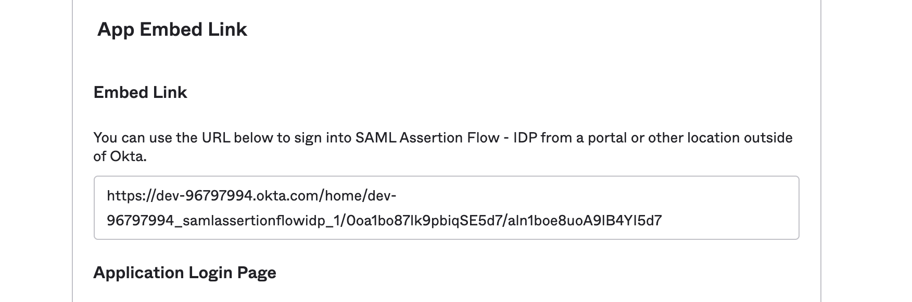
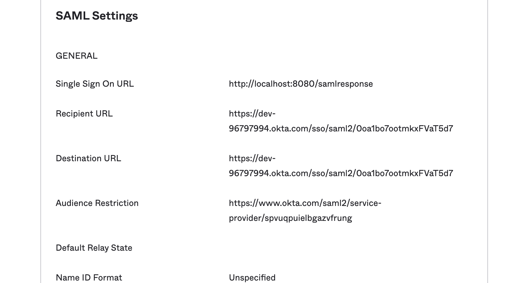
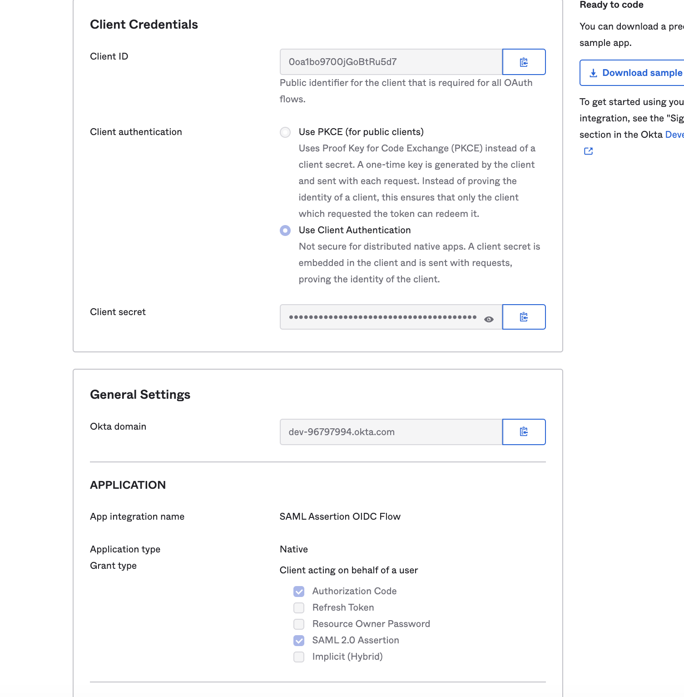
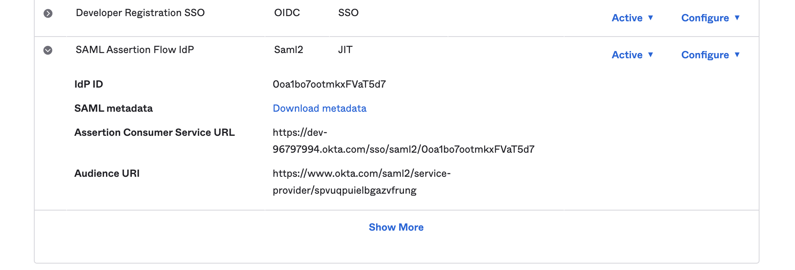

# Sample SAML Assertion Flow

This example shows how to use the [Okta SAML Assertion Flow](https://developer.okta.com/docs/guides/implement-saml2/overview/) to exchange an assertion for tokens.
The application uses the Okta Embed Link of a SAML Application to start an IdP Initiated flow. The SSO URL for the SAML application points to this application which will strip out the SAML Assertion, and then use it in a /token call to OKta.  

The application is already configured to use a preconfigured Okta Org. To view the configurations in Okta login to https://dev-96797994-admin.okta.com.  
Credentials  
Username: `read.only`  
Password: `Th1sPassword`  

Relevant Settings:
* Security -> Identity Providers -> SAML Assertion Flow IdP
* Applications -> Applications -> SAML Assertion Flow - IDP
* Applications -> Applications -> SAML Assertion OIDC Flow


### To Install
```
git clone https://github.com/emanor-okta/saml-assertion-flow-with-okta.git
cd saml-assertion-flow-with-okta
go mod tidy
```

### To Run
```
go run main.go
```  

1. Navigate to http://localhost:8080   
2. Click 'Get Tokens' to start the flow.   
3. Use credentials `read.only`/`Th1sPassword` to login. 
    
     
     
## The Flow
1. **Client Application** (localhost:8080)     
Click "Get Tokens" starts by redirecting to the SAML Application 'SAML Assertion Flow' by using the embedded URL    
`https://dev-96797994.okta.com/home/dev-96797994_samlassertionflowidp_1/0oa1bo87lk9pbiqSE5d7/aln1boe8uoA9lB4YI5d7`  
2. **SAML App** (SAML Assertion Flow - IDP)    
starts an IdP initiated flow. The **Single Sign On URL** is set to the client application which is where the SAML Response is sent to.
3. **Client Application** (localhost:8080)    
receives the SAML Response and extracts the SAML Assertion. Uses the assertion to call the /token endpoint of the OIDC application.
4. **OIDC App** (SAML Assertion OIDC Flow)     
OIDC application setup for the SAML Assertion flow. Passes the assertion to registered SAML IdP.
5. **SAML IdP** (SAML Assertion Flow IdP)     
verifies the SAML Assertion is  valid.
6. **OIDC App** (SAML Assertion OIDC Flow)     
returns tokens to the client application.
7. **Client Application** (localhost:8080)     
displays tokens.

     
     
 ## Configurations 
 ### SAML App (SAML Assertion Flow - IDP)
 Embed URL start IdP Initiated

The Destination and Recipient URLs are set for the SAML IdP setup in Okta. The **Single Sign On URL** is set to the application running on localhost so it can retrieve the SAML Assertion from the SAML Response.

    
### OIDC App (SAML Assertion OIDC Flow)
Native Application setup for the SAML Assertion Flow
    
     
### SAML IdP (SAML Assertion Flow IdP)
 
